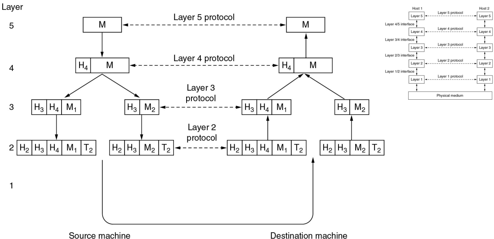
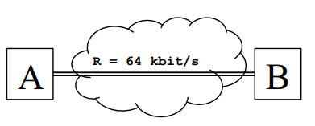
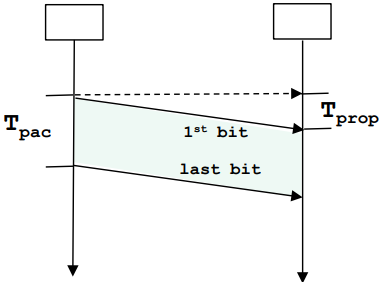
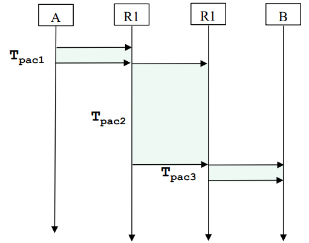

# INTRODUCTION

1. [Application Architectures](#application-architectures)
   - [Client-server Architecture](#client-server-architecture)
   - [P2P Architecture](#p2p-architecture)
2. [Types of Networks](#types-of-networks)
   - [1. Personal Area Network (PAN)](#1-personal-area-network-pan)
   - [2. Local Area Network (LAN)](#2-local-area-network-lan)
   - [3. Metropolitan Area Network (MAN)](#3-metropolitan-area-network-man)
   - [4. Wide Area Network (WAN)](#4-wide-area-network-wan)
3. [Network Software](#network-software)
   - [Transference of Information](#transference-of-information)
4. [Internet (TCP/IP) Reference Model](#internet-tcpip-reference-model)
   - [1. Application Layer](#1-application-layer)
   - [2. Transport Layer](#2-transport-layer)
   - [3. Internet Layer](#3-internet-layer)
   - [4. Link Layer](#4-link-layer)
   - [Key Features of the TCP/IP Model](#key-features-of-the-tcpip-model)
5. [Circuit Switching, Packet Switching](#circuit-switching-packet-switching)
   - [Circuit Switching (Cálculos)](#circuit-switching-calculos)
   - [Packet Switching (Cálculos)](#packet-switching-calculos)


# Application Architectures

## Client-server Architecture


### Server
- always-on computer
- permanent IP address, well-known name

### Clients
- communicate with server
- may be intermittently connected
- do not communicate directly with other clients

## P2P Architecture
- No always-on server
- Arbitrary end systems communicate directly
- Peers are intermittently connected and may change IP addresses


# Types of Networks

Networks can be classified based on their **scale**, **purpose**, or **technology**. Below is a categorization based on scale and functionality:

## 1. Personal Area Network (PAN)
- **Description**: Small-scale network designed for personal use.
- **Range**: Typically up to 10 meters.
- **Technologies**: Bluetooth, Infrared, Zigbee.
- **Examples**: Connecting a smartphone to wireless earbuds or a smartwatch.

## 2. Local Area Network (LAN)
- **Description**: Network covering a small geographical area, such as a home, office, or building.
- **Range**: Up to a few hundred meters.
- **Technologies**: Ethernet, Wi-Fi.
- **Examples**: Office networks, home Wi-Fi.

## 3. Metropolitan Area Network (MAN)
- **Description**: Network spanning a city or large campus.
- **Range**: Up to several kilometers.
- **Technologies**: Fiber optics, cable modems.
- **Examples**: City-wide Wi-Fi networks, university campus networks.

## 4. Wide Area Network (WAN)
- **Description**: Network covering a large geographical area, often spanning countries or continents.
- **Range**: Global.
- **Technologies**: Leased lines, satellite links, MPLS.
- **Examples**: The Internet, multinational corporate networks.

# Network Software
## Transference of Information


## Internet (TCP/IP) Reference Model

The Internet's TCP/IP reference model is a conceptual framework used to understand and implement networking protocols. It consists of four abstraction layers that define how data is transmitted and received over a network.


### 1. Application Layer
- **Purpose**: Supports network applications and end-user processes.
- **Functions**:
  - Provides protocols for specific use cases like file transfer, web browsing, and email.
  - Converts data into a format suitable for transmission.
- **Examples of Protocols**:
  - **HTTP**: Web browsing.
  - **SMTP**: Email.
  - **FTP**: File transfer.
  - **DNS**: Domain name resolution.


### 2. Transport Layer
- **Purpose**: Provides end-to-end communication and error recovery.
- **Functions**:
  - Ensures data reliability and flow control.
  - Handles segmentation and reassembly of data.
  - Implements error checking and retransmissions.
- **Examples of Protocols**:
  - **TCP**: Reliable, connection-oriented communication.
  - **UDP**: Fast, connectionless communication.


### 3. Internet Layer
- **Purpose**: Handles routing, addressing, and logical packet delivery between networks.
- **Functions**:
  - Assigns source and destination IP addresses.
  - Determines the best path for data transmission (routing).
- **Examples of Protocols**:
  - **IP**: Internet Protocol (IPv4 and IPv6).
  - **ICMP**: Internet Control Message Protocol (error reporting and diagnostics).
  - **ARP**: Address Resolution Protocol (resolves IP to MAC addresses).


### 4. Link Layer (Network Interface Layer)
- **Purpose**: Manages the physical transmission of data over network media.
- **Functions**:
  - Handles data encapsulation into frames.
  - Transmits frames over physical links (e.g., Ethernet, Wi-Fi).
  - Provides error detection for data link-level errors.
- **Examples of Technologies**:
  - Ethernet, Wi-Fi (802.11), PPP.


### Key Features of the TCP/IP Model
1. **Simplified Design**:
   - The model combines the physical and data link layers into a single **Link Layer**.
   - Focuses primarily on interoperability across different networks.

2. **End-to-End Principle**:
   - Most processing occurs at the endpoints, not within the network.

3. **Statelessness**:
   - Each packet is independent, allowing for scalable and robust communication.

4. **Flexibility**:
   - Protocols like IP can operate over a wide variety of physical networks.


This reference model forms the backbone of the modern Internet, enabling devices and systems to communicate seamlessly.

# Circuit Switching, Packet Switching


## Circuit Switching (Cálculos)

`T_total = T_establishment + T_propagação + T_msg`
 
- **Exercício:**
    ```
    A file of length L=640 kbit is transferred from Host A to Host B through a circuit
    having a capacity of C=64 kbit/s. Assuming a circuit establishment delay T_est=500 ms,
    and a propagation delay T_prop~0, what is the total file transfer delay? 
    ```

    


- **Dados:** 
    - `L=640`
    - `C=64 kbit/s`
    - `T_est=500 ms`
    - `T_prop~0`

- **Resolução:**
    ```
    T_total = T_establishment + T_propagação + T_msg
    <=> T_total = 500 ms + 0 ms + (L/C)
    <=> T_total = 0.5 s + (640/64) s
    <=> T_total = 10.5 s
    ```
    
 
## Packet Switching (Cálculos)

`T_end_to_end = T_pac1 + T_propagação1 + T_pac2 + T_propagação2 + ... + T_pac_n + T_propagação_n`

- **Exercício:**
    ```
    Host A sends a packet of length L=10 kbit to Host B through routers
    R1 and R2. Assuming propagation delay through the 3 links is Tprop~0 and
    that there are no queuing delays at the network elements (A, R1 and R2),
    what is the end-to-end packet delay?
    ```
    
    
- **Dados:** 
    - `L=10 kbit`
    - `T_prop~0`
    - `T_queue~0`
    - `T_pac1 = T_pac3` **`(=C, =L)`**

    

    
    

- **Resolução:**
    ```
    T_end_to_end = T_pac1 + T_propagação1 + T_pac2 + T_propagação2 + T_pac3 + T_propagação3
    <=> T_end_to_end =  (10 kbit / 100 Mbit/s) + 0 +  (10 kbit/ 10 Mbit/s) + 0 + (10 kbit / 100 Mbit/s) + 0
    <=> T_total = 0.1 ms + 1 ms + 0.1 ms
    <=> T_total = 1.2 ms
    ```
 