# DATA LINK LAYER

## Goal
- Provide communication between adjacent machines
## Main functions
- Eliminate/reduce transmission errors
- Regulate data flow
- Slow receivers not swamped by fast senders
    - Provide service to the network layer
## Services provided
- Unacknowledged connectionless service
- Acknowledged connectionless service
- Acknowledged connection-oriented service

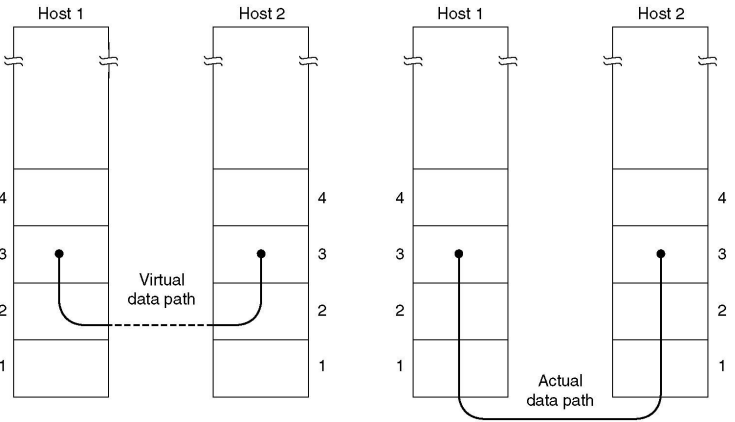

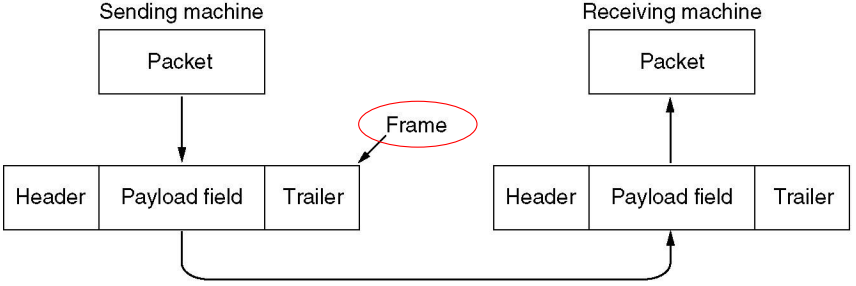

# Framing
## Character (byte) count

1. **Sender**:
   - Adds a **count field** at the start of each frame.
   - The count specifies the total number of bytes in the frame, including the count field itself.
2. **Receiver**:
   - Reads the count field to determine how many bytes to expect in the frame.
   - Extracts and processes the frame accordingly.

`If the count field says `**`10`**`, but the actual frame is `**`5`**` bytes, the receiver will read extra bytes, corrupting subsequent frames.`

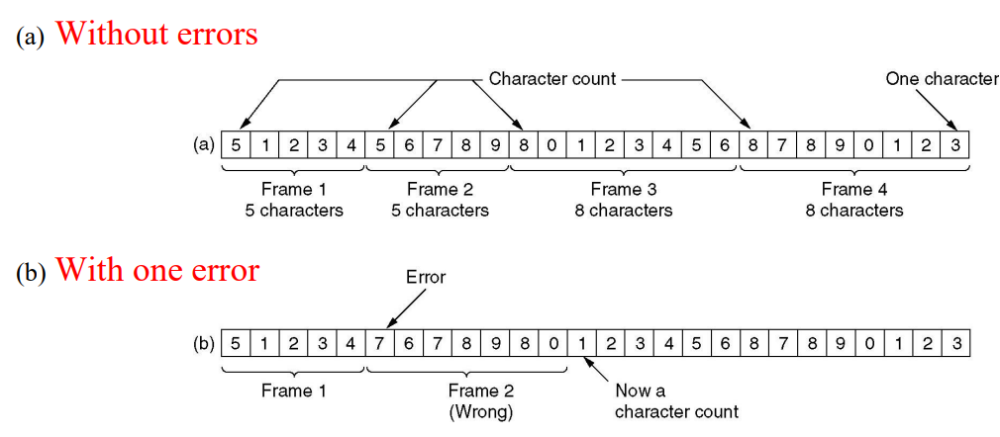

- O Frame 2 na imagem b deveria começar em `5`, não em `7`

## Flag bytes, with `byte stuffing`
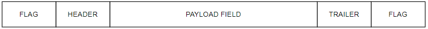

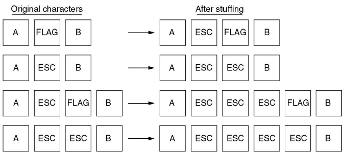

1. **Flag Byte**:
   - A special **flag byte** is used to mark the start and end of a frame.
   - Example: The flag byte could be a unique value like `01111110` (in hexadecimal: `0x7E`).

2. **Byte Stuffing**:
   - If the flag byte or another special control byte (e.g., escape byte) appears in the actual data, it is **stuffed** with an escape byte to prevent it from being misinterpreted as a frame boundary.

## Start and end flags, with `bit stuffing`

- Semelhante ao anterior

- **Example**:
    ```
    Flag = 01111110
    
    Se no payload forem encontradas sequências com 11111, é adicionado um 0 à frente, fazendo o stuffing.

    Assim, quando os dados forem lidos, o padrão 01111110 só vai aparecer nas flags e não no payload, pelo que o fim e início do frame é detetado corretamente.

    Posteriormente, para fazer o destuffing, sempre que for encontrada uma sequência de 111110, o 0 é removido, ou seja, o payload regressa ao formato original.
    ```

# Byte Stuffing Process

## Sender:
1. Adds a **flag byte** at the beginning and end of each frame.
2. Scans the payload data for occurrences of:
   - **Flag byte** (`0x7E`).
   - **Escape byte** (`0x7D`).
3. Inserts an escape byte (`0x7D`) before any flagged bytes in the data and modifies the flagged byte:
   - `0x7E` → `0x7D 0x5E` (flag byte).
   - `0x7D` → `0x7D 0x5D` (escape byte).

## Receiver:
1. Identifies the start and end of the frame using the flag bytes.
2. Scans the payload for escape sequences:
   - `0x7D 0x5E` → `0x7E`.
   - `0x7D 0x5D` → `0x7D`.
3. Reconstructs the original data by removing escape bytes and interpreting the flagged bytes correctly.


# Error Detection
## Effectiveness of error detection / METRICS
- **Minimum Distance of Code `d`**:
  - Minimum number of bit changes required to transform one valid codeword into another.
  - **Significance**:
    - Errors are detectable if fewer than \( d \) bits are corrupted.
    - Example: For \( d = 3 \), errors involving 1 or 2 bits are detected.

- **Burst Detecting Ability `B`**:
  - Maximum length of a burst of errors that the system can detect.
  - Example: `B = r`, where `r` is the number of redundancy bits.
 


## Parity Check 

Parity check is a basic and effective error detection technique. It involves adding a **parity bit** to a block of data to ensure that the number of `1`s in the block satisfies a specific rule (either even or odd). This helps the receiver detect errors in the transmitted data.


### **Key Concepts**

1. **Parity Bit**:
   - A single bit added to the original data.
   - Ensures that the total number of `1`s (including the parity bit) is either:
     - **Even** (even parity).
     - **Odd** (odd parity).

2. **Types of Parity**:
   - **Even Parity**:
     - Ensures the total number of `1`s is even.
     - Example:
       - Data: `1101`
       - Add parity bit: `1` (to make total `1`s = 4, an even number).
       - Result: `11011`
   - **Odd Parity**:
     - Ensures the total number of `1`s is odd.
     - Example:
       - Data: `1101`
       - Add parity bit: `0` (to make total `1`s = 3, an odd number).
       - Result: `11010`


### **How It Works**

**1. At the Sender**:
   - The sender calculates the parity bit based on the data.
   - Appends the parity bit to the data block.

**2. During Transmission**:
   - The data block (including the parity bit) is transmitted over the communication channel.
   - Noise or interference may flip one or more bits, introducing errors.

**3. At the Receiver**:
   - The receiver checks the parity of the received block (including the parity bit).
   - If the parity rule is violated, an error is detected.


### **Limitations of Parity Check**

1. **Error Detection**:
   - Detects all **single-bit errors** (one bit flipped).
   - Detects any **odd number of errors** (e.g., 3 bits flipped).

2. **Undetectable Errors**:
   - Cannot detect **even numbers of errors** (e.g., 2 bits flipped) because the parity remains unchanged.

3. **Error Correction**:
   - Parity check can only **detect errors**, but it cannot identify which bit is incorrect or correct the error.


## Bi-dimensional Parity Check
- Parity bit per row; parity bit per column

    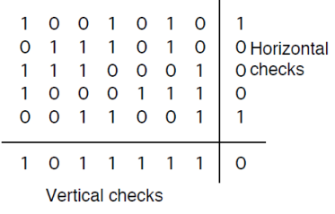
## **Limitations**
1. **Rectangular Error Patterns**:
   - Fails to detect errors that occur in a rectangular arrangement within the matrix.
   - Example: If errors occur in all four corners of a 2x2 block, parity rules remain satisfied.

    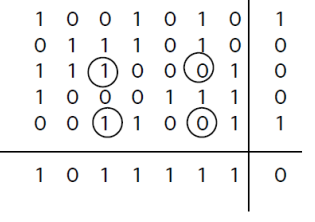
2. **Error Correction**:
   - Can only detect errors; it cannot correct them.


## Cyclic Redundancy Check (CRC)

### **Step 1: Polynomial Representation**
- Binary data is represented as a polynomial over `GF(2)` (a Galois Field with modulo-2 arithmetic).
  - Example:
    - Binary: `110011`
    - Polynomial: `x^5 + x^4 + x + 1`

### **Step 2: Append Zeros**
- Append `r` zeros to the end of the message, where `r` is the degree of `G(x)`. This prepares the message for division.
  - Example:
    - Message: `110011`
    - Appending `r = 3` zeros: `110011000`


### **Step 3: Polynomial Division**
- Divide the extended message (`M(x)*x^r`) by the generator polynomial (`G(x)`) using modulo-2 arithmetic.
  - The **remainder** of this division is the CRC check bits (`R(x)`).
  - Example:
    - Message: `110011`
    - `G(x) = x^3 + 1` (binary `1001`).
    - Compute the remainder: `R(x) = 011`.

    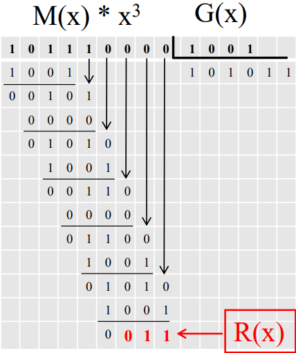

### **Step 4: Transmit Frame**
- Transmit the frame: `T(x) = M(x)*x^r + R(x)`.
  - Example:
    - Transmitted frame: `110011011`.

    - At the Receiver
        - If remainder R(x)=0 ➔ no errors
        - If remainder R(x) != 0 ➔ errors have occurred

    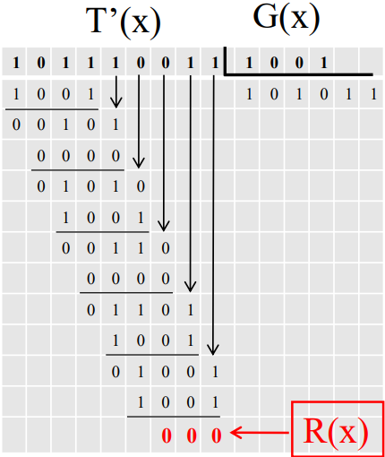


# Automatic Repeat reQuest (`ARQ`)

## Stop-n-Wait
### **1. Basic Process**
1. **Sender**:
   - Sends one data frame to the receiver.
   - Waits for an acknowledgment (ACK) from the receiver before sending the next frame.

2. **Receiver**:
   - Receives the frame and checks for errors (e.g., using CRC).
   - Sends an acknowledgment (ACK) back to the sender if the frame is correct.
   - If the frame contains errors, the receiver discards it and does not send an ACK.

3. **Timeout**:
   - If the sender does not receive an acknowledgment within a specified timeout period, it assumes the frame was lost or corrupted.
   - The sender retransmits the same frame.


### Loss of I frame
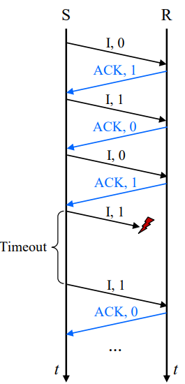

### Loss of ACK
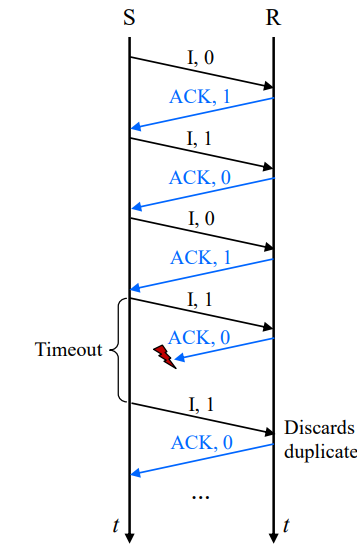

### Permature timeout
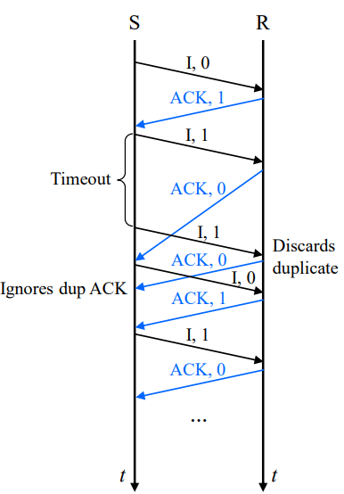

### Efficiency without errors

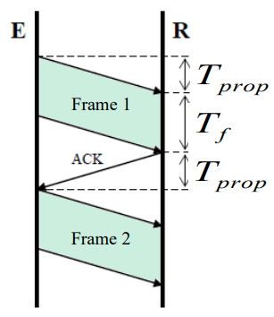 
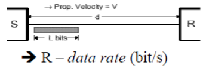

- `Dados dos problemas`
```
d = distance
L = message length (n bits)
R = data rate (bit/s)
Tprop = Propagation time of the sinal
Tf = time it takes to transmit a frame
a =  relationship between the time it takes for a signal to propagate over the communication channel and the time it takes to transmit a frame. 
```
- `a = Tprop/Tf`
- `S = Tf / (Tprop + Tf + Tprop)`

Dedução:
```
S = Tf / (Tprop + Tf + Tprop) <=>
<=> S = Tf / (2Tprop + Tf) <=>
<=> S = 1 / (2Tprop/Tf + 1) <=>
<=> S = 1 / (2a + 1)
```

**Example**

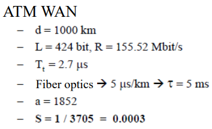

### Efficiency with errors
`p - frame error probablility`

`P[A = k] = (1-p)*p^(k-1)`

`E[A] = 1 / (1-p)`

```
S = Tf / (E[A] * (Tprop + Tf + Tprop)) <=>
<=> S = 1 / (E[A] * (1+2a)) <=>
<=> S = (1-p) / (1+2a)
```

### Round-trip-time
- inefficient when `Tprop > Tf (a>1)`
- Apenas envia um frame por RTT:

`RTT = 2 * Tprop + Tf`

## Sliding Window
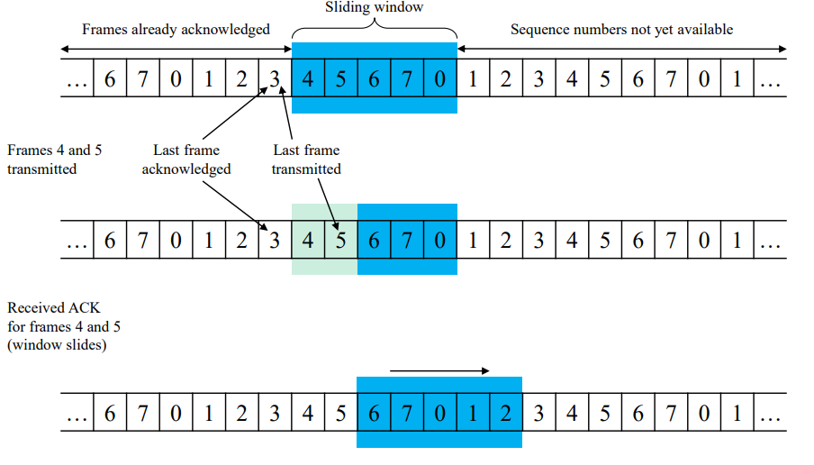

## Go Back N ARQ
