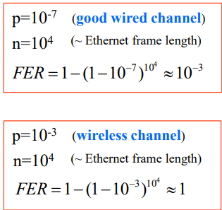

# [INTRODUCTION](1-introduction.md)
## [Circuit Switching](1-introduction.md/#circuit-switching-calculos)

- `T_total = T_establishment + T_propagação + T_msg`

## [Packet Switching](2-physical-layer.md/#nyquist-sampling-rate)

- `T_end_to_end = T_pac1 + T_propagação1 + T_pac2 + T_propagação2 + ... + T_pac_n + T_propagação_n`

# [PHYSICAL LAYER](2-physical-layer.md)
## [Reconstruction - Multilevel Modulation](2-physical-layer.md/#multilevel-modulation)

- `C = 2*B*log2(M)`

## [Reconstruction - Theoretical Capacity of Channel](2-physical-layer.md/#maximum-theoretical-capacity-of-a-channel-c-bits)

- `C = Bc * log2(1 + Pr / (N0*Bc))`

## [Free Space Loss](2-physical-layer.md/#free-space-loss)

- `Pt/Pr = (4*pi*d)^2 / λ^2 = [(4*pi*d)^2 / λ^2] = [(4*pi*f*d)^2 / c^2]`

# [DATA LINK LAYER](3-data-link-layer.md)

## [BER - BIR ERROR RATE]()
- `BER = Number of Erroneous Bits \ Total Number of Transmitted Bits`

## [Frame has no errors]()
- `P[frame has no errors] = (1 - BER)^n`

## [FER - FRAME ERROR RATE]()

- `FER = P[frame has errors] = 1 - (1 - BER)^n`

- `FER = P[frame has errors] = 1 - (1 - p)^n` - p = probability

# [DELAY MODELS](4-delay-models.md)
# [MAC SUBLAYER](5-mac-sublayer.md)
# [NETWORK LAYER](6-network-layer.md)
# [TRANSPORT LAYER](7-transport-layer.md)
# [ROUTING](8-routing.md)
# [APPLICATION LAYER](9-application-layer.md)
